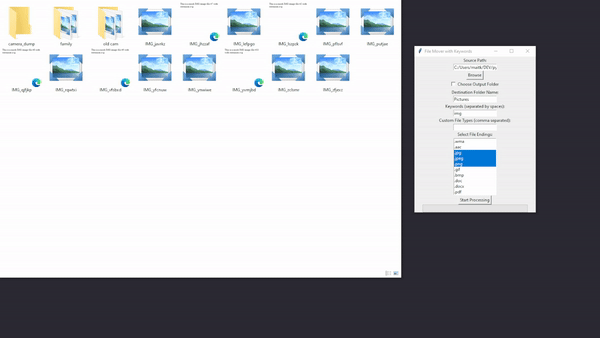

# File Mover with Keywords

This is a Python script that moves files based on keywords and file extensions. It provides a graphical user interface (GUI) for interacting with the script.

# Demo
In this File Mover application test scenario, we demonstrated how the application effectively organizes image files based on specific keywords and file extensions. The scenario was set up with the following elements:

Folder: camera_dump, family, vacation, old_cam and images
Keyword: img
Output folder: Pictures
File endings: .jpeg, .png, .svg, .jpg.
Outcome: All the pictures get moved into the output folder.



## Features

- Move files containing specific keywords to a new folder.
- Choose output folder or specify a destination folder name.
- Select file types to consider for moving.

## Usage
* Launch the script by running python file_mover.py.

* Fill in the required information:

* Source Path: The path of the directory where the script should search for files.
Keywords: Keywords separated by spaces that files should contain.
Destination Folder Name: Name of the new folder where matching files will be moved. You can also choose "Choose Output Folder" to select a folder using a file dialog.
Select the file endings you want to consider for moving.

* Click "Start Processing" to initiate the file moving process.

* A progress bar will show the progress of the operation.

* After completion, you'll receive a message indicating how many files were moved.

## Prerequisites

- Python 3.x
- Pip

## Getting Started

### Windows
[Download the executable from the release page](https://github.com/maitkaa/file_mover/releases)

1. Clone the repository:
```bash
   git clone https://github.com/your-username/file-mover.git
   cd file-mover
 ```
2. Run the script:
 ```bash
   python file_mover.py
```

## Automatic Executable Release

An executable release is automatically generated on every push to the main branch using GitHub Actions.

* The executable release is created as an artifact and can be downloaded from the GitHub Actions page.
